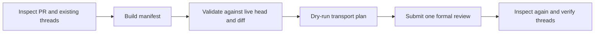

# The gh-code-review lab

This guide shows the extension doing real work on public, sanitized pull
requests. Every example has four parts:

1. the changed file on GitHub;
2. the exact command or agent prompt used;
3. the formal review GitHub created;
4. an automated verifier that checks the evidence still exists.

The examples never use `gh pr comment`. Findings appear as resolvable review
threads on **Files changed**, grouped under one review decision.

## Pick a route

### Ask an agent

Install both the extension and the portable skill:

```bash
gh extension install wildcard/gh-code-review
gh skill install wildcard/gh-code-review gh-code-review \
  --agent codex --scope user
```

Then give the agent a PR and explicit write authorization:

```text
Use $gh-code-review to inspect https://github.com/OWNER/REPO/pull/123.
Review only the changed code and post one formal COMMENT review with the
smallest honest anchors. Use apply-able suggestions when the correction is
exact. Do not use a flat PR comment. Verify the resulting review and report
its URL.
```

For Claude Code, install the same canonical skill as a plugin:

```bash
claude plugin marketplace add wildcard/gh-code-review
claude plugin install gh-code-review@gh-code-review
```

Then use the same prompt, replacing `$gh-code-review` with
`the gh-code-review skill` if the client does not support `$skill` syntax.
See [agent-guided reviews](demos/agent-guides.md) for recorded Codex and
Claude examples and prompts for Cursor, Copilot CLI, and other skill-compatible
agents.

### Drive the extension directly

```bash
gh code-review capabilities
gh code-review inspect 123 -R OWNER/REPO --unresolved
python3 scripts/demo_lab.py render \
  --scenario core-transaction \
  --pull-request 123 \
  --output /tmp/review.json
gh code-review validate --input /tmp/review.json
gh code-review submit --input /tmp/review.json --dry-run
gh code-review submit --input /tmp/review.json
```

The manifest is the review transaction. It lets you inspect every anchor,
body, suggestion, and decision before GitHub is changed.

## Live scenario map

| Scenario | What it demonstrates | Guide |
| --- | --- | --- |
| Core transaction | Inspect, multiline suggestion, REST batch, dry run, submit, replay | [Core transaction](demos/core-transaction.md) |
| Mixed review | Line and whole-file findings in one GraphQL-backed review | [Mixed review](demos/mixed-review.md) |
| Review lifecycle | Pending review, add/edit/delete, replies, resolve, review summary, viewed state | [Lifecycle](demos/review-lifecycle.md) |
| Guardrails and fallback | Stale head, self-approval, dismissal safety, Python/`gh api` fallback | [Guardrails](demos/guardrails-fallback.md) |
| Agent-guided reviews | The same skill used by Codex and Claude Code | [Agent guides](demos/agent-guides.md) |

The public PR and review URLs are recorded in
[`demo/evidence.json`](../demo/evidence.json). Run the read-only verifier:

```bash
python3 scripts/demo_lab.py verify --live
```

## The normal review transaction



### 1. Inspect

```bash
gh code-review inspect 123 -R OWNER/REPO --unresolved
```

Add `--include bodies` when duplicate detection needs full comment text. Add
`--include patches` only when the local diff is unavailable.

### 2. Build or render a manifest

The canonical format is JSON; the extension also accepts YAML.

```json
{
  "schema_version": "1.0",
  "repository": "OWNER/REPO",
  "pull_request": 123,
  "expected_head_sha": "HEAD_FROM_INSPECT",
  "event": "COMMENT",
  "summary": "Focused review of the changed request path.",
  "idempotency_key": "review-123-HEAD_FROM_INSPECT",
  "comments": [
    {
      "client_id": "guard-error-result",
      "subject": "line",
      "path": "src/request.go",
      "line": 42,
      "side": "RIGHT",
      "body": "The result is used even when the request fails.",
      "replacement": "if err != nil {\n\treturn err\n}"
    }
  ]
}
```

### 3. Validate and preview

```bash
gh code-review validate --input review.json
gh code-review submit --input review.json --dry-run
```

Both commands also accept `--input -`, auto-detecting JSON or YAML from standard
input. Agents can stream a generated manifest without creating a temporary file.

Validation is read-only. It rejects stale heads, invalid sides/ranges,
cross-hunk ranges, malformed suggestions, duplicate findings, pending-review
conflicts, unsupported host behavior, and self-approval.

### 4. Submit and verify

```bash
gh code-review submit --input review.json
gh code-review inspect 123 -R OWNER/REPO --include bodies
```

Unspecified review feedback defaults to `COMMENT`. `APPROVE` and
`REQUEST_CHANGES` require explicit authorization and `--confirm-decision`.

## Reproduce the lab in your own repository

The demo controller is deliberately safe by default:

```bash
python3 scripts/demo_lab.py list
python3 scripts/demo_lab.py create --scenario core-transaction
```

The second command refuses to write until `--confirm` is supplied. The
controller creates one branch and one intentionally unmergeable dummy PR,
using the sanitized proposal under `demo/proposals/`.

```bash
python3 scripts/demo_lab.py create \
  --scenario core-transaction \
  --confirm
```

Use a fork and edit `repository` in [`demo/scenarios.json`](../demo/scenarios.json)
when you want your own writable copy.

## Direct API fallback

If extension installation is declined, the bundled standard-library Python
helper keeps the same manifest workflow:

```bash
python3 skills/gh-code-review/scripts/gh_code_review_fallback.py \
  inspect 123 -R OWNER/REPO
python3 skills/gh-code-review/scripts/gh_code_review_fallback.py \
  validate --input review.json
python3 skills/gh-code-review/scripts/gh_code_review_fallback.py \
  submit --input review.json
```

The extension remains preferable because it covers the complete lifecycle and
returns richer validation and recovery receipts.

## What the evidence proves

The lab verifier checks:

- every documented PR still exists;
- the expected submitted reviews and review comments still exist;
- the recorded review states match;
- no scenario created a flat issue/PR comment;
- the scenario catalog covers every public command group;
- each agent example has a portable prompt.

CI validates the catalog offline on every change. A separate read-only workflow
can verify the public GitHub evidence without creating reviews.
